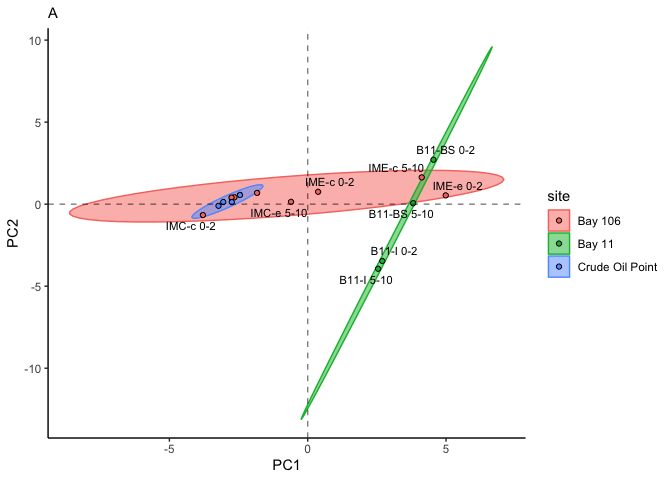
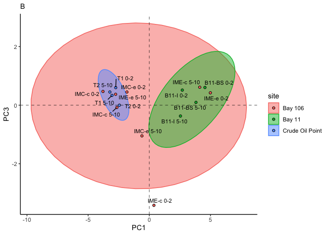
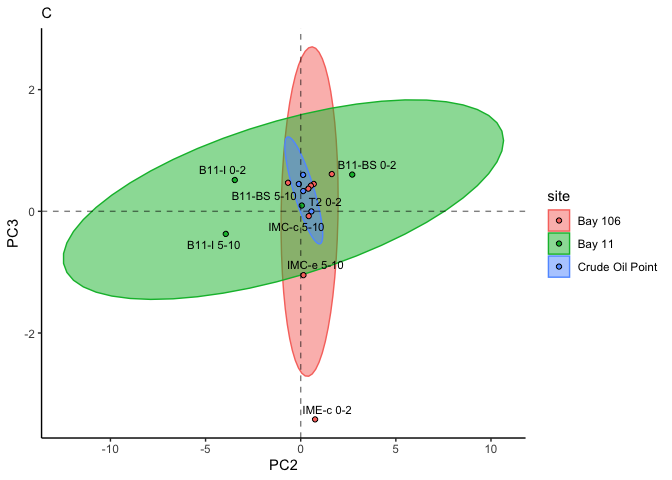
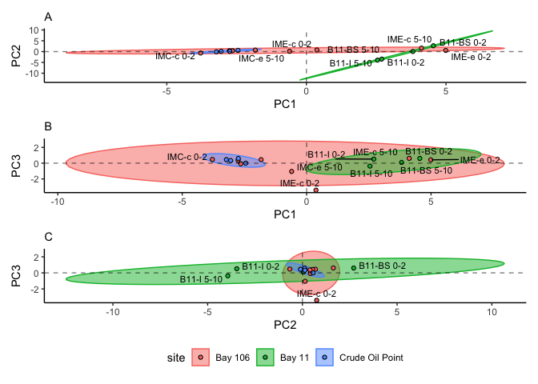

# Code written and executed by **Blake Hunnie** (hunnieb@myumanitoba.ca)
This R-markdown file is intended for the reproducibility of manipulating and presenting N-alkane data from the BIOS site.
Most of the code included below comes from the **tidyverse**, rather than solely **Base-R**.

# All necessary data & information must be loaded into R:
## First, the packages included in my typical workflows are loaded:


```r
library(tidyverse)
```

```
## ── Attaching packages ─────────────────────────────────────── tidyverse 1.3.2 ──
## ✔ ggplot2 3.4.0      ✔ purrr   1.0.1 
## ✔ tibble  3.1.8      ✔ dplyr   1.0.10
## ✔ tidyr   1.2.1      ✔ stringr 1.5.0 
## ✔ readr   2.1.3      ✔ forcats 0.5.2 
## ── Conflicts ────────────────────────────────────────── tidyverse_conflicts() ──
## ✖ dplyr::filter() masks stats::filter()
## ✖ dplyr::lag()    masks stats::lag()
```

```r
library(janitor)
```

```
## 
## Attaching package: 'janitor'
## 
## The following objects are masked from 'package:stats':
## 
##     chisq.test, fisher.test
```

```r
library(here)
```

```
## here() starts at /Users/blake/Library/Mobile Documents/com~apple~CloudDocs/Desktop/M.Sc./Manuscripts/N-alkanes/R/Alkylbenzene PCA
```

```r
library(gt)
library(broom) 
library(fs)
library(stats)
library(ggrepel)
library(patchwork)
library(ggfortify)
library(knitr)
```


```r
alkylbenzene_dataset <- read_csv(here("data", "tidy_individual_AB_pca.csv")) #loading in the csv.file dataset
```

```
## Rows: 16 Columns: 20
## ── Column specification ────────────────────────────────────────────────────────
## Delimiter: ","
## chr  (4): site, sample_type, sample_id, sample_depth
## dbl (16): n-Butylbenzene, n-Pentylbenzene, n-Hexylbenzene, n-Heptylbenzene, ...
## 
## ℹ Use `spec()` to retrieve the full column specification for this data.
## ℹ Specify the column types or set `show_col_types = FALSE` to quiet this message.
```


```r
ab_dataset_continuous <- alkylbenzene_dataset %>% #assigning the dataset to an object
  select(-site, -sample_id, -sample_depth, -sample_type) #removing any non-continuous data columns
ab_dataset_continuous #calling the object
```

```
## # A tibble: 16 × 16
##    n-Butylbenz…¹ n-Pen…² n-Hex…³ n-Hep…⁴ n-Oct…⁵ n-Non…⁶ n-Dec…⁷ n-Und…⁸ n-Dod…⁹
##            <dbl>   <dbl>   <dbl>   <dbl>   <dbl>   <dbl>   <dbl>   <dbl>   <dbl>
##  1         0.259  0.103   0.115   0.0553  0.0896   0.375    1.64    1.56    5.90
##  2         0.206  0.172   0.152   0.276   0.174    1.10     4.49    4.26    7.25
##  3         1.22   0.132   0.205   0.464   1.59     3.27     9.40    5.27    5.58
##  4         1.43   1.40    1.31    1.37    0.644    7.37     7.41    5.26    7.59
##  5         1.07   1.06    0.987   1.03    1.88     6.30     7.34    8.50   10.6 
##  6         1.91   1.88    1.75    1.83    2.70    12.6     16.9    17.6    11.2 
##  7         6.11   3.10    2.24    2.33    2.48    12.7     13.7    17.2    12.3 
##  8         0.163  0.160   0.156   0.156   0.187    1.14     3.73    4.39    5.96
##  9         1.53   1.51    1.41    1.47    1.56    15.9     20.6    18.1    13.0 
## 10         2.73   2.69    2.51    2.62    2.81     8.20    18.2    18.8     8.95
## 11         1.45   4.78    4.47    4.65    1.48     4.94     7.55   12.6    10.3 
## 12         2.11   4.63    4.32    4.50    4.83     5.44     6.11    9.88    7.24
## 13         0.779  0.521   0.360   0.140   0.229    0.893    3.06    3.49    6.36
## 14         0.203  0.0964  0.0578  0.0490  0.0782   0.445    2.83    4.59    8.43
## 15         0.658  0.426   0.204   0.121   0.0770   0.587    2.98    3.92    7.31
## 16         0.236  0.135   0.0752  0.0532  0.0782   0.421    2.66    4.22    8.07
## # … with 7 more variables: `n-Tridecylbenzene` <dbl>,
## #   `n-Tetradecylbenzene` <dbl>, `n-Pentadecylbenzene` <dbl>,
## #   `n-Hexadecylbenzene` <dbl>, `n-Heptadecylbenzene` <dbl>,
## #   `n-Octadecylbenzene` <dbl>, `n-Nonadecylbenzene` <dbl>, and abbreviated
## #   variable names ¹​`n-Butylbenzene`, ²​`n-Pentylbenzene`, ³​`n-Hexylbenzene`,
## #   ⁴​`n-Heptylbenzene`, ⁵​`n-Octylbenzene`, ⁶​`n-Nonylbenzene`,
## #   ⁷​`n-Decylbenzene`, ⁸​`n-Undecylbenzene`, ⁹​`n-Dodecylbenzene`
```


```r
ab_pca <- ab_dataset_continuous %>% #assigning the continuous dataset to an object
  prcomp(center = TRUE, scale = TRUE) #performing a PCA
summary(ab_pca) #summarizing the results from the object
```

```
## Importance of components:
##                           PC1    PC2     PC3     PC4     PC5     PC6     PC7
## Standard deviation     3.2345 1.6329 1.01199 0.79825 0.67007 0.60198 0.36266
## Proportion of Variance 0.6539 0.1666 0.06401 0.03982 0.02806 0.02265 0.00822
## Cumulative Proportion  0.6539 0.8205 0.88454 0.92436 0.95243 0.97507 0.98329
##                            PC8    PC9    PC10    PC11    PC12    PC13     PC14
## Standard deviation     0.32648 0.2743 0.23755 0.15196 0.06831 0.03480 0.007005
## Proportion of Variance 0.00666 0.0047 0.00353 0.00144 0.00029 0.00008 0.000000
## Cumulative Proportion  0.98996 0.9947 0.99819 0.99963 0.99992 1.00000 1.000000
##                            PC15      PC16
## Standard deviation     0.003496 1.337e-16
## Proportion of Variance 0.000000 0.000e+00
## Cumulative Proportion  1.000000 1.000e+00
```


```r
combined_data <- cbind(alkylbenzene_dataset, ab_pca$x[,1:3]) #combining the first 3 columns of the PCA results to the initial table
combined_data #calling the combined dataset
```

```
##               site sample_type   sample_id sample_depth n-Butylbenzene
## 1          Bay 106       oiled   IMC-c 0-2      surface      0.2589227
## 2          Bay 106       oiled  IMC-c 5-10   subsurface      0.2057921
## 3          Bay 106       oiled   IMC-e 0-2      surface      1.2151538
## 4          Bay 106       oiled  IMC-e 5-10   subsurface      1.4255023
## 5          Bay 106       oiled   IME-c 0-2      surface      1.0730336
## 6          Bay 106       oiled  IME-c 5-10   subsurface      1.9063354
## 7          Bay 106       oiled   IME-e 0-2      surface      6.1093664
## 8          Bay 106       oiled  IME-e 5-10   subsurface      0.1627646
## 9           Bay 11       oiled  B11-BS 0-2      surface      1.5346275
## 10          Bay 11       oiled B11-BS 5-10   subsurface      2.7326996
## 11          Bay 11       oiled   B11-I 0-2      surface      1.4483419
## 12          Bay 11       oiled  B11-I 5-10   subsurface      2.1077206
## 13 Crude Oil Point       oiled      T1 0-2      surface      0.7788280
## 14 Crude Oil Point       oiled     T1 5-10   subsurface      0.2027373
## 15 Crude Oil Point       oiled      T2 0-2      surface      0.6582936
## 16 Crude Oil Point       oiled     T2 5-10   subsurface      0.2360115
##    n-Pentylbenzene n-Hexylbenzene n-Heptylbenzene n-Octylbenzene n-Nonylbenzene
## 1       0.10274160     0.11450746      0.05531889     0.08963364      0.3748590
## 2       0.17210343     0.15197158      0.27564842     0.17380135      1.1032989
## 3       0.13155126     0.20485929      0.46392412     1.59105312      3.2738380
## 4       1.40365548     1.31080668      1.36542362     0.64391102      7.3745860
## 5       1.05658863     0.98669756      1.02780995     1.87741957      6.3008486
## 6       1.87711957     1.75295213      1.82599180     2.70409902     12.5734746
## 7       3.10254725     2.23598616      2.32915225     2.47740279     12.7376045
## 8       0.16027014     0.15584367      0.15590481     0.18723861      1.1364984
## 9       1.51110829     1.41115171      1.46994970     1.56159936     15.8551317
## 10      2.69081914     2.51282722      2.61752835     2.80599039      8.1988293
## 11      4.78288083     4.46650350      4.65260781     1.48318813      4.9350227
## 12      4.63087895     4.32455622      4.50474606     4.82908778      5.4371675
## 13      0.52090901     0.35966292      0.14007801     0.22884617      0.8933477
## 14      0.09643643     0.05784580      0.04898004     0.07822550      0.4450158
## 15      0.42630000     0.20381513      0.12074108     0.07699190      0.5866345
## 16      0.13518467     0.07520085      0.05316554     0.07818155      0.4205292
##    n-Decylbenzene n-Undecylbenzene n-Dodecylbenzene n-Tridecylbenzene
## 1        1.635270         1.559116         5.904163          8.672674
## 2        4.489212         4.256284         7.248091          9.986953
## 3        9.400527         5.271058         5.582356          9.191669
## 4        7.405117         5.258996         7.594163         10.701893
## 5        7.337531         8.504197        10.566976         10.372286
## 6       16.862925        17.637051        11.169040          2.388397
## 7       13.661065        17.223899        12.338753          3.046531
## 8        3.730093         4.392879         5.961298          7.808856
## 9       20.610795        18.115128        12.985693          2.706663
## 10      18.235270        18.819774         8.945738          6.265241
## 11       7.553785        12.559442        10.345124          1.247026
## 12       6.106748         9.882398         7.237028          5.892208
## 13       3.058850         3.494821         6.357538          7.645788
## 14       2.826406         4.591196         8.425945         10.064416
## 15       2.983251         3.924523         7.313061          8.372051
## 16       2.664827         4.218672         8.066285         10.009966
##    n-Tetradecylbenzene n-Pentadecylbenzene n-Hexadecylbenzene
## 1            11.009230           22.676981          11.439426
## 2            10.934655           24.541007           8.879208
## 3            10.930515           16.693808           9.494981
## 4            11.922554           12.945321           7.837532
## 5            17.744835           12.193826           1.517047
## 6             2.403005           13.467613           2.695164
## 7             3.027898            4.576551           3.437829
## 8             9.834042           29.571091           9.231535
## 9             1.934454            9.490748           2.169646
## 10            3.444667            3.476078           3.863472
## 11            6.122832            6.178663           6.867249
## 12            5.928246            5.982303           6.649005
## 13            9.684896           27.644326          10.074022
## 14           10.973546           19.758064          10.729435
## 15           10.039850           32.160946           6.358280
## 16           10.952446           18.231192          12.320278
##    n-Heptadecylbenzene n-Octadecylbenzene n-Nonadecylbenzene        PC1
## 1            14.335974          12.189231           9.581951 -3.7884293
## 2            11.315343           8.460665           7.805965 -2.6475678
## 3             7.380486          10.568752           8.605468 -1.8297419
## 4            10.428390           7.393119           4.989030 -0.6027142
## 5            12.149701           5.737154           1.554049  0.3762458
## 6             6.033077           1.942855           2.760900  4.1226044
## 7             7.695519           2.478218           3.521678  4.9903228
## 8            11.474385           9.261648           6.775652 -2.7546315
## 9             4.856714           1.564026           2.222564  4.5469688
## 10            8.648314           2.785050           3.957703  3.8147966
## 11           15.372216           4.950375           7.034743  2.6970237
## 12           14.883681           4.793050           6.811176  2.5458487
## 13           11.190478          10.484097           7.443513 -2.7447080
## 14           11.446423          10.400728           9.854600 -3.0528939
## 15           11.490902           8.023793           7.260567 -2.4482029
## 16           11.907569          10.959133           9.671359 -3.2249211
##            PC2         PC3
## 1  -0.66455591  0.46893228
## 2   0.42069506 -0.07835444
## 3   0.68729663  0.44973212
## 4   0.14334675 -1.04921574
## 5   0.75529398 -3.41965728
## 6   1.63358490  0.61256972
## 7   0.53646999  0.42127860
## 8   0.40236901  0.37207294
## 9   2.70763952  0.60365027
## 10  0.05645611  0.09512807
## 11 -3.46378566  0.51453104
## 12 -3.93724372 -0.37100555
## 13  0.12545549  0.59897352
## 14  0.13108839  0.33282574
## 15  0.56416839 -0.00105486
## 16 -0.09827894  0.44959357
```

##The next three chunks of code are nearly identical; They're meant to produce figures representing the results of PC1xPC2, PC1xPC3, and PC2xPC3 (only the first chunk will have comments)


```r
PC1_PC2_plot <- combined_data %>% #assigning the combined dataset to an object
  ggplot() + #creating a ggplot item
  stat_ellipse(aes(x = PC1, y = PC2, colour = site, fill = site), geom = "polygon", alpha = 0.5) + #creating a 95% confidence interval ellipse
  geom_point(aes(x = PC1, y = PC2, colour = site, fill = site), shape = 21, colour = "black") + #plotting the PC1xPC2 results
  geom_text_repel(aes(x = PC1, y = PC2, label = sample_id), size = 3) + #preventing text from overlapping on the plot
  geom_hline(aes(yintercept = 0), linetype = "dashed", alpha = 0.5) + #creating a dashed horizontal line on y=0
  geom_vline(aes(xintercept = 0), linetype = "dashed", alpha = 0.5) + #creating a dashed vertical line on x=0
  labs(subtitle = "A") + #adding a subtitle
  theme_classic() #assigning the classic tidyverse theme
PC1_PC2_plot #calling the plot
```

```
## Warning: ggrepel: 7 unlabeled data points (too many overlaps). Consider
## increasing max.overlaps
```

<!-- -->

```r
ggsave(here("figures", "pc1_pc2.pdf"), PC1_PC2_plot, #saving the plot as a pdf. file
       width = 190, height = 160, units = "mm") #setting the size parameters of the plot
```

```
## Warning: ggrepel: 6 unlabeled data points (too many overlaps). Consider
## increasing max.overlaps
```


```r
PC1_PC3_plot <- combined_data %>%
  ggplot() +
  stat_ellipse(aes(x = PC1, y = PC3, colour = site, fill = site), geom = "polygon", alpha = 0.5) +
  geom_point(aes(x = PC1, y = PC3, colour = site, fill = site), shape = 21, colour = "black") +
  geom_text_repel(aes(x = PC1, y = PC3, label = sample_id), size = 3) +
  geom_hline(aes(yintercept = 0), linetype = "dashed", alpha = 0.5) +
  geom_vline(aes(xintercept = 0), linetype = "dashed", alpha = 0.5) +
  labs(subtitle = "B") +
  theme_classic() 
PC1_PC3_plot
```

<!-- -->

```r
ggsave(here("figures", "pc1_pc3.pdf"), PC1_PC3_plot,
       width = 190, height = 120, units = "mm") 
```


```r
PC2_PC3_plot <- combined_data %>%
  ggplot() +
  stat_ellipse(aes(x = PC2, y = PC3, colour = site, fill = site), geom = "polygon", alpha = 0.5) +
  geom_point(aes(x = PC2, y = PC3, colour = site, fill = site), shape = 21, colour = "black") +
  geom_text_repel(aes(x = PC2, y = PC3, label = sample_id), size = 3) +
  geom_hline(aes(yintercept = 0), linetype = "dashed", alpha = 0.5) +
  geom_vline(aes(xintercept = 0), linetype = "dashed", alpha = 0.5) +
  labs(subtitle = "C") +
  theme_classic() 
PC2_PC3_plot
```

```
## Warning: ggrepel: 8 unlabeled data points (too many overlaps). Consider
## increasing max.overlaps
```

<!-- -->

```r
ggsave(here("figures", "pc2_pc3.pdf"), PC2_PC3_plot,
       width = 190, height = 120, units = "mm") 
```

```
## Warning: ggrepel: 8 unlabeled data points (too many overlaps). Consider
## increasing max.overlaps
```

##This next section serves to combine the three above plots into a single file


```r
full_plot <- #creating an object
  PC1_PC2_plot + #adding the first plot to the object
  PC1_PC3_plot + #adding the second plot to the object
  PC2_PC3_plot + #adding the third plot to the object
  plot_layout(ncol = 1, guides = 'collect') & theme(legend.position = 'bottom') #assigning the layout of the three plots
full_plot #calling the plot
```

```
## Warning: ggrepel: 7 unlabeled data points (too many overlaps). Consider increasing max.overlaps
## ggrepel: 7 unlabeled data points (too many overlaps). Consider increasing max.overlaps
```

```
## Warning: ggrepel: 12 unlabeled data points (too many overlaps). Consider
## increasing max.overlaps
```

<!-- -->

```r
ggsave(here("figures", "full_plot.pdf"), full_plot, #saving the plot as a pdf. file
       width = 190, height = 290, units = "mm") #assigning the size parameters to the plot
```

```
## Warning: ggrepel: 7 unlabeled data points (too many overlaps). Consider
## increasing max.overlaps
```

```
## Warning: ggrepel: 3 unlabeled data points (too many overlaps). Consider
## increasing max.overlaps
```

```
## Warning: ggrepel: 9 unlabeled data points (too many overlaps). Consider
## increasing max.overlaps
```


