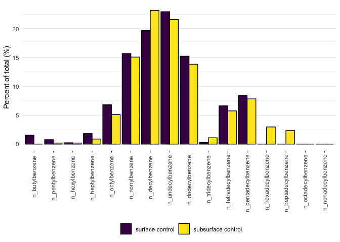
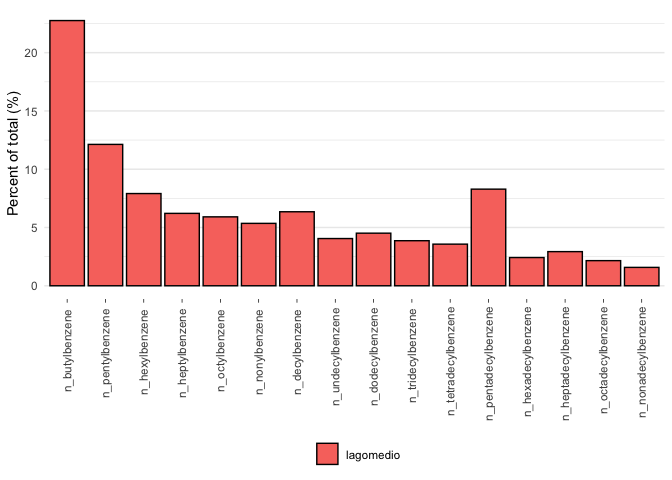

# Code written and executed by **Blake Hunnie** (hunnieb@myumanitoba.ca)
This R-markdown file is intended for the reproducibility of manipulating and presenting data from the BIOS site.
Most of the code included below comes from the **tidyverse**, rather than solely **Base-R**.

# All necessary data & information must be loaded into R:
## First, the packages included in my typical workflows are loaded:


```r
library(tidyverse)
```

```
## ── Attaching packages ─────────────────────────────────────── tidyverse 1.3.2 ──
## ✔ ggplot2 3.4.0      ✔ purrr   1.0.1 
## ✔ tibble  3.1.8      ✔ dplyr   1.0.10
## ✔ tidyr   1.2.1      ✔ stringr 1.5.0 
## ✔ readr   2.1.3      ✔ forcats 0.5.2 
## ── Conflicts ────────────────────────────────────────── tidyverse_conflicts() ──
## ✖ dplyr::filter() masks stats::filter()
## ✖ dplyr::lag()    masks stats::lag()
```

```r
library(janitor)
```

```
## 
## Attaching package: 'janitor'
## 
## The following objects are masked from 'package:stats':
## 
##     chisq.test, fisher.test
```

```r
library(here)
```

```
## here() starts at /Users/blake/Library/Mobile Documents/com~apple~CloudDocs/Desktop/M.Sc./Manuscripts/N-alkanes/R/Alkylbenzene data
```

```r
library(gt)
library(broom) 
library(fs)
library(viridis)
```

```
## Loading required package: viridisLite
```


```r
alkylbenzene_data <- read_csv(here("data", "tidy_individual_ab_percentages.csv")) %>% #loading in the csv. file dataset
  clean_names() %>% #altering column names in accordance to tidyverse
  pivot_longer(cols = c(n_butylbenzene, n_pentylbenzene, n_hexylbenzene, n_heptylbenzene, n_octylbenzene, n_nonylbenzene, n_decylbenzene, n_undecylbenzene, n_dodecylbenzene, n_tridecylbenzene, n_tetradecylbenzene, n_pentadecylbenzene, n_hexadecylbenzene, n_heptadecylbenzene, n_octadecylbenzene, n_nonadecylbenzene), names_to = "parameter", values_to = "measure") #taking many columns and converting it into fewer, longer columns
```

```
## Rows: 32 Columns: 20
## ── Column specification ────────────────────────────────────────────────────────
## Delimiter: ","
## chr  (4): site, sample_type, sample_id, sample_depth
## dbl (16): n-Butylbenzene, n-Pentylbenzene, n-Hexylbenzene, n-Heptylbenzene, ...
## 
## ℹ Use `spec()` to retrieve the full column specification for this data.
## ℹ Specify the column types or set `show_col_types = FALSE` to quiet this message.
```

```r
alkylbenzene_data #calling the dataset
```

```
## # A tibble: 512 × 6
##    site    sample_type sample_id sample_depth parameter         measure
##    <chr>   <chr>       <chr>     <chr>        <chr>               <dbl>
##  1 Bay 102 control     N12       surface      n_butylbenzene       1.31
##  2 Bay 102 control     N12       surface      n_pentylbenzene      1.74
##  3 Bay 102 control     N12       surface      n_hexylbenzene       1.83
##  4 Bay 102 control     N12       surface      n_heptylbenzene      2.58
##  5 Bay 102 control     N12       surface      n_octylbenzene       6.60
##  6 Bay 102 control     N12       surface      n_nonylbenzene      17.5 
##  7 Bay 102 control     N12       surface      n_decylbenzene      22.9 
##  8 Bay 102 control     N12       surface      n_undecylbenzene    22.0 
##  9 Bay 102 control     N12       surface      n_dodecylbenzene    10.9 
## 10 Bay 102 control     N12       surface      n_tridecylbenzene    1.39
## # … with 502 more rows
```


```r
nested_data <- alkylbenzene_data %>% #assigning the dataset to an object
  group_by(site, sample_depth, sample_type) %>% #grouping the data by 3 variables: site, sample depth, and sample type
  nest() #nesting the data
nested_data #calling the nested data
```

```
## # A tibble: 14 × 4
## # Groups:   site, sample_depth, sample_type [14]
##    site            sample_type sample_depth data             
##    <chr>           <chr>       <chr>        <list>           
##  1 Bay 102         control     surface      <tibble [48 × 3]>
##  2 Bay 102         control     subsurface   <tibble [48 × 3]>
##  3 Bay 106         oiled       surface      <tibble [64 × 3]>
##  4 Bay 106         oiled       subsurface   <tibble [64 × 3]>
##  5 Bay 11          oiled       surface      <tibble [32 × 3]>
##  6 Bay 11          oiled       subsurface   <tibble [32 × 3]>
##  7 Crude Oil Point oiled       surface      <tibble [32 × 3]>
##  8 Crude Oil Point oiled       subsurface   <tibble [32 × 3]>
##  9 Crude Oil Point control     surface      <tibble [16 × 3]>
## 10 Crude Oil Point control     subsurface   <tibble [16 × 3]>
## 11 Milne Inlet     control     surface      <tibble [32 × 3]>
## 12 Milne Inlet     control     subsurface   <tibble [32 × 3]>
## 13 Resolute        control     surface      <tibble [32 × 3]>
## 14 Resolute        control     subsurface   <tibble [32 × 3]>
```


```r
nested_plots <- nested_data %>% #assigning the nested dataset to an object
  mutate(plot = pmap(list(site, sample_type, sample_depth, data), #creating individual objects to automatically generate plots from
                     ~ ggplot() + #creating plots
                       geom_col(data = ..4, aes(x = parameter, y = measure, fill = sample_id), colour = "black", position = "dodge") + #sequentially creating bar plots from the nested data
                       labs(y = "Percent of total (%)") + #labelling the y-axis
                       scale_x_discrete(limits = c("n_butylbenzene", "n_pentylbenzene", "n_hexylbenzene", "n_heptylbenzene", "n_octylbenzene", "n_nonylbenzene", "n_decylbenzene", "n_undecylbenzene", "n_dodecylbenzene", "n_tridecylbenzene", "n_tetradecylbenzene", "n_pentadecylbenzene", "n_hexadecylbenzene", "n_heptadecylbenzene", "n_octadecylbenzene", "n_nonadecylbenzene")) + #ordering the observations on the x-axis
                       theme_minimal() + #assigning the tidyverse minimal theme to the plot
                       scale_fill_viridis(discrete = TRUE) + #changing the colour palette
                       theme(axis.title.x = element_blank(), #removing the title from the x-axis
                             axis.text.x = element_text(angle = 90, vjust = 0.5, hjust = 0.9), #changing the angle of the x-axis text
                             legend.title = element_blank(), #removing the title from the legend
                             axis.ticks.x = element_line(size = 0.25), #changing the size of the x-axis tick marks
                             panel.grid.major.x = element_blank(), #removing the panelling
                             legend.position = "bottom"), #changing the position of the legend
                     labs(title = str_c(..1, ..2, ..3, "sediments", sep = ", "))), #sequentially assigning the titles for each plot
         filename = str_c(site, sample_type, sample_depth, "plot.pdf", sep = "_")) #assigning a filename to each plot
```

```
## Warning: The `size` argument of `element_line()` is deprecated as of ggplot2 3.4.0.
## ℹ Please use the `linewidth` argument instead.
```

```r
nested_plots #calling the nested plots
```

```
## # A tibble: 14 × 6
## # Groups:   site, sample_depth, sample_type [14]
##    site            sample_type sample_depth data              plot   filename   
##    <chr>           <chr>       <chr>        <list>            <list> <chr>      
##  1 Bay 102         control     surface      <tibble [48 × 3]> <gg>   Bay 102_co…
##  2 Bay 102         control     subsurface   <tibble [48 × 3]> <gg>   Bay 102_co…
##  3 Bay 106         oiled       surface      <tibble [64 × 3]> <gg>   Bay 106_oi…
##  4 Bay 106         oiled       subsurface   <tibble [64 × 3]> <gg>   Bay 106_oi…
##  5 Bay 11          oiled       surface      <tibble [32 × 3]> <gg>   Bay 11_oil…
##  6 Bay 11          oiled       subsurface   <tibble [32 × 3]> <gg>   Bay 11_oil…
##  7 Crude Oil Point oiled       surface      <tibble [32 × 3]> <gg>   Crude Oil …
##  8 Crude Oil Point oiled       subsurface   <tibble [32 × 3]> <gg>   Crude Oil …
##  9 Crude Oil Point control     surface      <tibble [16 × 3]> <gg>   Crude Oil …
## 10 Crude Oil Point control     subsurface   <tibble [16 × 3]> <gg>   Crude Oil …
## 11 Milne Inlet     control     surface      <tibble [32 × 3]> <gg>   Milne Inle…
## 12 Milne Inlet     control     subsurface   <tibble [32 × 3]> <gg>   Milne Inle…
## 13 Resolute        control     surface      <tibble [32 × 3]> <gg>   Resolute_c…
## 14 Resolute        control     subsurface   <tibble [32 × 3]> <gg>   Resolute_c…
```


```r
nested_plots_save <- nested_plots %>% #assigning the nested plots to an object
  ungroup() %>% #must ungroup the nested data to save it
  select(filename, plot) %>% #choosing the parameters to save each file from
  pwalk(ggsave, path =  here("figures"), width = 190, height = 120, units = "mm") #sequentially saving each plot based on the two above variables
```

##This next section is dedicated to creating individual plots from the control sample datasets 


```r
alkylbenzene_controls <- read_csv(here("data", "controls_alkylbenzenes.csv")) %>% #importing the csv. file dataset
  clean_names() %>% #altering the column names in accordance to the tidyverse
  pivot_longer(cols = c(n_butylbenzene, n_pentylbenzene, n_hexylbenzene, n_heptylbenzene, n_octylbenzene, n_nonylbenzene, n_decylbenzene, n_undecylbenzene, n_dodecylbenzene, n_tridecylbenzene, n_tetradecylbenzene, n_pentadecylbenzene, n_hexadecylbenzene, n_heptadecylbenzene, n_octadecylbenzene, n_nonadecylbenzene), names_to = "parameter", values_to = "measure") #taking many columns and converting it into fewer, longer columns
```

```
## Rows: 2 Columns: 17
## ── Column specification ────────────────────────────────────────────────────────
## Delimiter: ","
## chr  (1): sample_id
## dbl (16): n-Butylbenzene, n-Pentylbenzene, n-Hexylbenzene, n-Heptylbenzene, ...
## 
## ℹ Use `spec()` to retrieve the full column specification for this data.
## ℹ Specify the column types or set `show_col_types = FALSE` to quiet this message.
```

```r
alkylbenzene_controls #calling the dataset
```

```
## # A tibble: 32 × 3
##    sample_id       parameter         measure
##    <chr>           <chr>               <dbl>
##  1 surface control n_butylbenzene      1.54 
##  2 surface control n_pentylbenzene     0.768
##  3 surface control n_hexylbenzene      0.229
##  4 surface control n_heptylbenzene     1.82 
##  5 surface control n_octylbenzene      6.81 
##  6 surface control n_nonylbenzene     15.7  
##  7 surface control n_decylbenzene     19.7  
##  8 surface control n_undecylbenzene   22.9  
##  9 surface control n_dodecylbenzene   15.2  
## 10 surface control n_tridecylbenzene   0.282
## # … with 22 more rows
```


```r
control_plot <- alkylbenzene_controls %>% #assigning the control dataset to an object 
  mutate(across(sample_id, factor, levels=c("surface control","subsurface control"))) %>% #separating the results based on sample depth
  ggplot() + #creating the ggplot
  geom_col(aes(x = parameter, y = measure, fill = sample_id), colour = "black", position = "dodge") + #creating a bar plot
  labs(y = "Percent of total (%)") + #labelling the y-axis
  scale_x_discrete(limits = c("n_butylbenzene", "n_pentylbenzene", "n_hexylbenzene", "n_heptylbenzene", "n_octylbenzene", "n_nonylbenzene", "n_decylbenzene", "n_undecylbenzene", "n_dodecylbenzene", "n_tridecylbenzene", "n_tetradecylbenzene", "n_pentadecylbenzene", "n_hexadecylbenzene", "n_heptadecylbenzene", "n_octadecylbenzene", "n_nonadecylbenzene")) + #assigning the order to the observations on the x-axis
  theme_minimal() + #assigning the theme to the plots
  scale_fill_viridis(discrete = TRUE) + #changing the colour palette 
  theme(axis.title.x = element_blank(), #removing the title from the x-axis
        axis.text.x = element_text(angle = 90, vjust = 0.5, hjust = 0.9), #changing the angle of the x-axis text
        legend.title = element_blank(), #removing the title from the legend
        axis.ticks.x = element_line(size = 0.25), #changing the size of the x-axis tick marks
        panel.grid.major.x = element_blank(), #removing the panelling
        legend.position = "bottom") #changing the position of the legend
control_plot #calling the plot
```

<!-- -->

```r
ggsave(here("figures", "control_plot.pdf"), control_plot, #saving the plot as a pdf. file 
       width = 190, height = 120, units = "mm") #setting the size parameters of the saved file
```

##Finally, this section does the same as the control samples, but for the technical mixture (refer to comments in the above section)


```r
lagomedio_data <- read_csv(here("data", "tidy_lagomedio_ab_percentages.csv")) %>%
  clean_names() %>%
 pivot_longer(cols = c(n_butylbenzene, n_pentylbenzene, n_hexylbenzene, n_heptylbenzene, n_octylbenzene, n_nonylbenzene, n_decylbenzene, n_undecylbenzene, n_dodecylbenzene, n_tridecylbenzene, n_tetradecylbenzene, n_pentadecylbenzene, n_hexadecylbenzene, n_heptadecylbenzene, n_octadecylbenzene, n_nonadecylbenzene), names_to = "parameter", values_to = "measure")
```

```
## Rows: 1 Columns: 17
## ── Column specification ────────────────────────────────────────────────────────
## Delimiter: ","
## chr  (1): sample_id
## dbl (16): n-Butylbenzene, n-Pentylbenzene, n-Hexylbenzene, n-Heptylbenzene, ...
## 
## ℹ Use `spec()` to retrieve the full column specification for this data.
## ℹ Specify the column types or set `show_col_types = FALSE` to quiet this message.
```

```r
lagomedio_data
```

```
## # A tibble: 16 × 3
##    sample_id parameter           measure
##    <chr>     <chr>                 <dbl>
##  1 lagomedio n_butylbenzene        22.8 
##  2 lagomedio n_pentylbenzene       12.1 
##  3 lagomedio n_hexylbenzene         7.91
##  4 lagomedio n_heptylbenzene        6.21
##  5 lagomedio n_octylbenzene         5.91
##  6 lagomedio n_nonylbenzene         5.35
##  7 lagomedio n_decylbenzene         6.35
##  8 lagomedio n_undecylbenzene       4.05
##  9 lagomedio n_dodecylbenzene       4.51
## 10 lagomedio n_tridecylbenzene      3.87
## 11 lagomedio n_tetradecylbenzene    3.57
## 12 lagomedio n_pentadecylbenzene    8.29
## 13 lagomedio n_hexadecylbenzene     2.42
## 14 lagomedio n_heptadecylbenzene    2.93
## 15 lagomedio n_octadecylbenzene     2.16
## 16 lagomedio n_nonadecylbenzene     1.58
```


```r
lagomedio_plot <- lagomedio_data %>%
  ggplot() +
  geom_col(aes(x = parameter, y = measure, fill = sample_id), colour = "black", position = "dodge") +
  labs(y = "Percent of total (%)") +
  scale_x_discrete(limits = c("n_butylbenzene", "n_pentylbenzene", "n_hexylbenzene", "n_heptylbenzene", "n_octylbenzene", "n_nonylbenzene", "n_decylbenzene", "n_undecylbenzene", "n_dodecylbenzene", "n_tridecylbenzene", "n_tetradecylbenzene", "n_pentadecylbenzene", "n_hexadecylbenzene", "n_heptadecylbenzene", "n_octadecylbenzene", "n_nonadecylbenzene")) +
  theme_minimal() +
  #scale_fill_viridis(discrete = TRUE) +
  theme(axis.title.x = element_blank(),
        axis.text.x = element_text(angle = 90, vjust = 0.5, hjust = 0.9),
        legend.title = element_blank(),
        axis.ticks.x = element_line(size = 0.25),
        panel.grid.major.x = element_blank(),
        legend.position = "bottom")
lagomedio_plot
```

<!-- -->

```r
ggsave(here("figures", "lagomedio_plot.pdf"), lagomedio_plot,
       width = 190, height = 120, units = "mm") 
```


