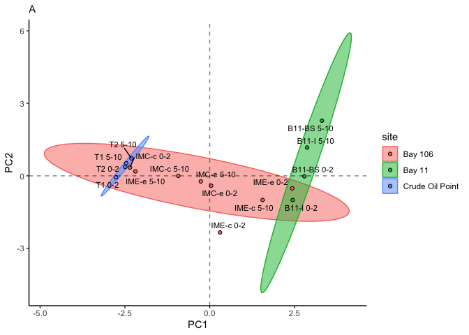
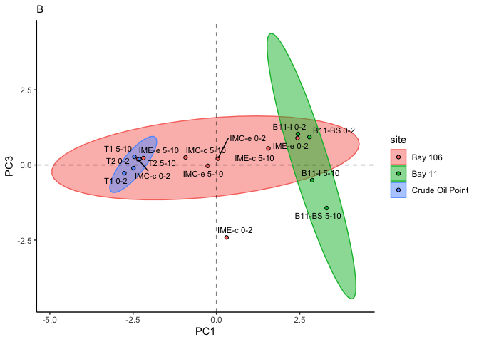
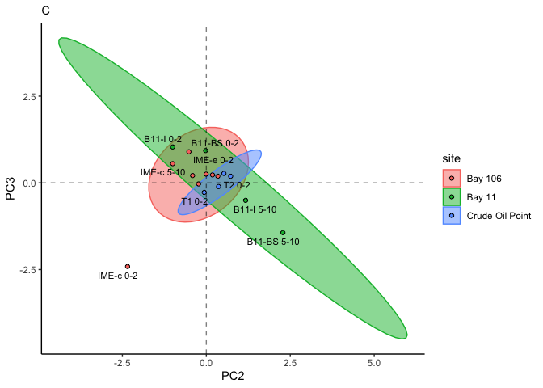
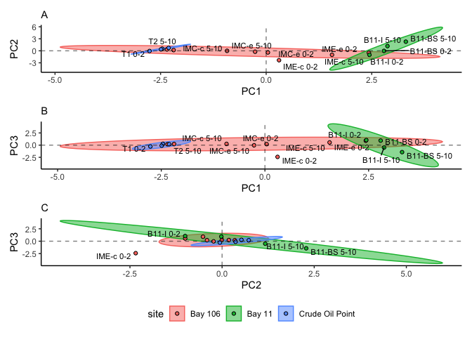

# Code written and executed by **Blake Hunnie** (hunnieb@myumanitoba.ca)
This R-markdown file is intended for the reproducibility of manipulating and presenting data from the BIOS site.
Most of the code included below comes from the **tidyverse**, rather than solely **Base-R**.

# All necessary data & information must be loaded into R:
## First, the packages included in my typical workflows are loaded:


```r
library(tidyverse)
```

```
## ── Attaching packages ─────────────────────────────────────── tidyverse 1.3.2 ──
## ✔ ggplot2 3.4.0      ✔ purrr   1.0.1 
## ✔ tibble  3.1.8      ✔ dplyr   1.0.10
## ✔ tidyr   1.2.1      ✔ stringr 1.5.0 
## ✔ readr   2.1.3      ✔ forcats 0.5.2 
## ── Conflicts ────────────────────────────────────────── tidyverse_conflicts() ──
## ✖ dplyr::filter() masks stats::filter()
## ✖ dplyr::lag()    masks stats::lag()
```

```r
library(janitor)
```

```
## 
## Attaching package: 'janitor'
## 
## The following objects are masked from 'package:stats':
## 
##     chisq.test, fisher.test
```

```r
library(here)
```

```
## here() starts at /Users/blake/Library/Mobile Documents/com~apple~CloudDocs/Desktop/M.Sc./Manuscripts/N-alkanes/R/Alkylcycloalkane PCA
```

```r
library(gt)
library(broom) 
library(fs)
library(stats)
library(ggrepel)
library(patchwork)
```


```r
alkylcycloalkane_dataset <- read_csv(here("data", "tidy_individual_ACA_pca.csv")) #loading in the csv.file dataset
```

```
## Rows: 16 Columns: 12
## ── Column specification ────────────────────────────────────────────────────────
## Delimiter: ","
## chr (4): site, sample_type, sample_id, sample_depth
## dbl (8): n-Heptylcyclohexane, n-Octylcyclohexane, n-Nonylcyclohexane, n-Decy...
## 
## ℹ Use `spec()` to retrieve the full column specification for this data.
## ℹ Specify the column types or set `show_col_types = FALSE` to quiet this message.
```


```r
aca_dataset_continuous <- alkylcycloalkane_dataset %>% #assigning the dataset to an object
  select(-site, -sample_id, -sample_depth, -sample_type) #removing any non-continuous data columns
aca_dataset_continuous #calling the object
```

```
## # A tibble: 16 × 8
##    `n-Heptylcyclohexane` n-Oct…¹ n-Non…² n-Dec…³ n-Und…⁴ n-Dod…⁵ n-Tri…⁶ n-Tet…⁷
##                    <dbl>   <dbl>   <dbl>   <dbl>   <dbl>   <dbl>   <dbl>   <dbl>
##  1                0.0643   0.189   1.36    13.9    10.0    22.8    24.9    26.7 
##  2                0.404    1.44    4.52    27.4    10.2    19.3    18.1    18.7 
##  3                0.790    3.03    6.47    35.5     9.10   16.1    14.1    15.0 
##  4                0.432    0.582   6.45    36.1    10.5    16.0    13.8    16.1 
##  5                1.04     2.37    3.63    45.6     2.13    2.33    2.34   40.5 
##  6                0.653    3.91   11.6     51.6     9.33   13.0     5.06    4.87
##  7                1.93     9.28   12.3     42.3    11.5    12.9     4.88    4.91
##  8                0.506    0.575   2.14    15.0     7.96   24.6    22.8    26.4 
##  9                1.35     9.93    8.28    47.9    17.1    12.2     1.60    1.66
## 10                2.91     3.09    3.08    52.5    28.1     3.25    3.45    3.59
## 11                0.645    3.07   25.3     43.7    13.1     8.53    2.63    3.06
## 12                3.66     1.62   17.1     40.6    18.1    11.5     1.52    5.89
## 13                0.443    0.403   0.719    9.22    6.34   21.9    26.3    34.7 
## 14                0.111    0.141   0.631   12.6    10.5    24.8    24.3    26.9 
## 15                0.210    0.244   0.430   11.3     9.96   21.8    25.4    30.7 
## 16                0.149    0.242   0.492   12.4    12.2    23.5    24.5    26.6 
## # … with abbreviated variable names ¹​`n-Octylcyclohexane`,
## #   ²​`n-Nonylcyclohexane`, ³​`n-Decylcyclohexane`, ⁴​`n-Undecylcyclohexane`,
## #   ⁵​`n-Dodecylcyclohexane`, ⁶​`n-Tridecylcyclohexane`,
## #   ⁷​`n-Tetradecylcyclohexane`
```


```r
aca_pca <- aca_dataset_continuous %>% #assigning the continuous dataset to an object
  prcomp(scale = TRUE) #performing a PCA
summary(aca_pca) #summarizing the results from the object
```

```
## Importance of components:
##                           PC1    PC2     PC3     PC4     PC5     PC6     PC7
## Standard deviation     2.2783 1.0217 0.87844 0.76645 0.54065 0.31019 0.13300
## Proportion of Variance 0.6488 0.1305 0.09646 0.07343 0.03654 0.01203 0.00221
## Cumulative Proportion  0.6488 0.7793 0.87579 0.94922 0.98576 0.99779 1.00000
##                             PC8
## Standard deviation     1.48e-10
## Proportion of Variance 0.00e+00
## Cumulative Proportion  1.00e+00
```


```r
combined_data <- cbind(alkylcycloalkane_dataset, aca_pca$x[,1:3]) #combining the first 3 columns of the PCA results to the initial table
combined_data #calling the combined dataset
```

```
##               site sample_type   sample_id sample_depth n-Heptylcyclohexane
## 1          Bay 106       oiled   IMC-c 0-2      surface          0.06430494
## 2          Bay 106       oiled  IMC-c 5-10   subsurface          0.40356778
## 3          Bay 106       oiled   IMC-e 0-2      surface          0.78962969
## 4          Bay 106       oiled  IMC-e 5-10   subsurface          0.43172235
## 5          Bay 106       oiled   IME-c 0-2      surface          1.03856511
## 6          Bay 106       oiled  IME-c 5-10   subsurface          0.65323990
## 7          Bay 106       oiled   IME-e 0-2      surface          1.92699986
## 8          Bay 106       oiled  IME-e 5-10   subsurface          0.50634135
## 9           Bay 11       oiled  B11-BS 0-2      surface          1.34654417
## 10          Bay 11       oiled B11-BS 5-10   subsurface          2.90853547
## 11          Bay 11       oiled   B11-I 0-2      surface          0.64475559
## 12          Bay 11       oiled  B11-I 5-10   subsurface          3.65795572
## 13 Crude Oil Point       oiled      T1 0-2      surface          0.44336240
## 14 Crude Oil Point       oiled     T1 5-10   subsurface          0.11132343
## 15 Crude Oil Point       oiled      T2 0-2      surface          0.21010456
## 16 Crude Oil Point       oiled     T2 5-10   subsurface          0.14940274
##    n-Octylcyclohexane n-Nonylcyclohexane n-Decylcyclohexane
## 1           0.1889952          1.3608628          13.948007
## 2           1.4389729          4.5235718          27.373653
## 3           3.0282601          6.4698118          35.461533
## 4           0.5822056          6.4466659          36.107102
## 5           2.3745960          3.6317990          45.615586
## 6           3.9137723         11.5607848          51.599977
## 7           9.2804924         12.2698130          42.288169
## 8           0.5749562          2.1404145          15.015308
## 9           9.9310149          8.2839609          47.916380
## 10          3.0932044          3.0816626          52.541472
## 11          3.0652411         25.3011815          43.676097
## 12          1.6173463         17.1383957          40.624728
## 13          0.4027355          0.7194490           9.215482
## 14          0.1410229          0.6308376          12.613124
## 15          0.2439508          0.4304129          11.287822
## 16          0.2418402          0.4924928          12.370678
##    n-Undecylcyclohexane n-Dodecylcyclohexane n-Tridecylcyclohexane
## 1             10.000208            22.783526             24.906695
## 2             10.177082            19.251377             18.113787
## 3              9.100448            16.068533             14.105970
## 4             10.509437            15.960106             13.812997
## 5              2.129764             2.327375              2.337935
## 6              9.328210            13.013749              5.056009
## 7             11.534659            12.915563              4.877814
## 8              7.961067            24.592930             22.774438
## 9             17.055120            12.207488              1.597685
## 10            28.079833             3.254790              3.451000
## 11            13.088225             8.534395              2.634521
## 12            18.051756            11.499893              1.524706
## 13             6.344634            21.871409             26.290132
## 14            10.539920            24.829829             24.254107
## 15             9.963652            21.762011             25.359897
## 16            12.190193            23.507426             24.479071
##    n-Tetradecylcyclohexane         PC1          PC2         PC3
## 1                26.747401 -2.34916967  0.343616884  0.19103854
## 2                18.717989 -0.92648065 -0.004617195  0.25124290
## 3                14.975814  0.04109192 -0.409600751  0.21015753
## 4                16.149764 -0.26233341 -0.231271380 -0.03085311
## 5                40.544380  0.30433098 -2.344642789 -2.41172803
## 6                 4.874258  1.55925946 -1.001572452  0.55409548
## 7                 4.906490  2.43246257 -0.518406809  0.89742526
## 8                26.434544 -2.19106903  0.183300089  0.22882975
## 9                 1.661806  2.79019326 -0.020122669  0.93159903
## 10                3.589502  3.30721152  2.281689166 -1.43450119
## 11                3.055584  2.44477839 -1.002053478  1.03567766
## 12                5.885219  2.87250049  1.170364781 -0.50425380
## 13               34.712795 -2.76246933 -0.060780823 -0.27405183
## 14               26.879837 -2.46137873  0.524347131  0.27170167
## 15               30.742151 -2.49020993  0.365497185 -0.10644069
## 16               26.568897 -2.30871784  0.724253111  0.19006084
```

##The next three chunks of code are nearly identical; They're meant to produce figures representing the results of PC1xPC2, PC1xPC3, and PC2xPC3 (only the first chunk will have comments)


```r
PC1_PC2_plot <- combined_data %>% #assigning the combined dataset to an object
  ggplot() + #creating a ggplot item
  stat_ellipse(aes(x = PC1, y = PC2, colour = site, fill = site), geom = "polygon", alpha = 0.5) + #creating a 95% confidence interval ellipse
  geom_point(aes(x = PC1, y = PC2, colour = site, fill = site), shape = 21, colour = "black") + #plotting the PC1xPC2 results
  geom_text_repel(aes(x = PC1, y = PC2, label = sample_id), size = 3) + #preventing text from overlapping on the plot
  geom_hline(aes(yintercept = 0), linetype = "dashed", alpha = 0.5) + #creating a dashed horizontal line on y=0
  geom_vline(aes(xintercept = 0), linetype = "dashed", alpha = 0.5) + #creating a dashed vertical line on x=0
  labs(subtitle = "A") + #adding a subtitle
  theme_classic() #applying the classic tidyverse theme to the plot
PC1_PC2_plot #calling the plot
```

<!-- -->

```r
ggsave(here("figures", "pc1_pc2.pdf"), PC1_PC2_plot, #saving the plot as a pdf. file
       width = 190, height = 160, units = "mm") #setting the size parameters of the saved plot
```


```r
PC1_PC3_plot <- combined_data %>%
  ggplot() +
  stat_ellipse(aes(x = PC1, y = PC3, colour = site, fill = site), geom = "polygon", alpha = 0.5) +
  geom_point(aes(x = PC1, y = PC3, colour = site, fill = site), shape = 21, colour = "black") +
  geom_text_repel(aes(x = PC1, y = PC3, label = sample_id), size = 3) +
  geom_hline(aes(yintercept = 0), linetype = "dashed", alpha = 0.5) +
  geom_vline(aes(xintercept = 0), linetype = "dashed", alpha = 0.5) +
  labs(subtitle = "B") +
  theme_classic() #+
  #theme(legend.position = "none")
PC1_PC3_plot
```

```
## Warning in MASS::cov.trob(data[, vars]): Probable convergence failure
```

<!-- -->

```r
ggsave(here("figures", "pc1_pc3.pdf"), PC1_PC3_plot,
       width = 190, height = 120, units = "mm") 
```

```
## Warning in MASS::cov.trob(data[, vars]): Probable convergence failure
```


```r
PC2_PC3_plot <- combined_data %>%
  ggplot() +
  stat_ellipse(aes(x = PC2, y = PC3, colour = site, fill = site), geom = "polygon", alpha = 0.5) +
  geom_point(aes(x = PC2, y = PC3, colour = site, fill = site), shape = 21, colour = "black") +
  geom_text_repel(aes(x = PC2, y = PC3, label = sample_id), size = 3) +
  geom_hline(aes(yintercept = 0), linetype = "dashed", alpha = 0.5) +
  geom_vline(aes(xintercept = 0), linetype = "dashed", alpha = 0.5) +
  labs(subtitle = "C") +
  theme_classic() #+
  #theme(legend.position = "none")
PC2_PC3_plot
```

```
## Warning in MASS::cov.trob(data[, vars]): Probable convergence failure
```

```
## Warning: ggrepel: 7 unlabeled data points (too many overlaps). Consider
## increasing max.overlaps
```

<!-- -->

```r
ggsave(here("figures", "pc2_pc3.pdf"), PC2_PC3_plot,
       width = 190, height = 120, units = "mm") 
```

```
## Warning in MASS::cov.trob(data[, vars]): Probable convergence failure
```

```
## Warning: ggrepel: 8 unlabeled data points (too many overlaps). Consider
## increasing max.overlaps
```

##This next section serves to combine the three above plots into a single file


```r
full_plot <- #creating an object
  PC1_PC2_plot + #adding the first plot to the object
  PC1_PC3_plot + #adding the second plot to the object
  PC2_PC3_plot + #adding the third plot to the object
  plot_layout(ncol = 1, guides = 'collect') & theme(legend.position = 'bottom') #assigning the layout of the three plots
full_plot #calling the plot
```

```
## Warning in MASS::cov.trob(data[, vars]): Probable convergence failure

## Warning in MASS::cov.trob(data[, vars]): Probable convergence failure
```

```
## Warning: ggrepel: 4 unlabeled data points (too many overlaps). Consider increasing max.overlaps
## ggrepel: 4 unlabeled data points (too many overlaps). Consider increasing max.overlaps
```

```
## Warning: ggrepel: 12 unlabeled data points (too many overlaps). Consider
## increasing max.overlaps
```

<!-- -->

```r
ggsave(here("figures", "full_plot.pdf"), full_plot, #saving the plot as a pdf. file
       width = 190, height = 290, units = "mm") #assigning the size parameters of the plot
```

```
## Warning in MASS::cov.trob(data[, vars]): Probable convergence failure
```

```
## Warning in MASS::cov.trob(data[, vars]): Probable convergence failure
```

```
## Warning: ggrepel: 2 unlabeled data points (too many overlaps). Consider
## increasing max.overlaps
```

```
## Warning: ggrepel: 9 unlabeled data points (too many overlaps). Consider
## increasing max.overlaps
```


