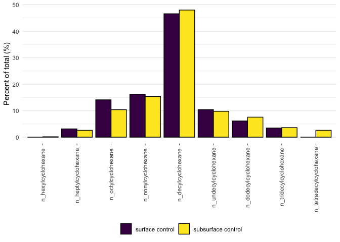
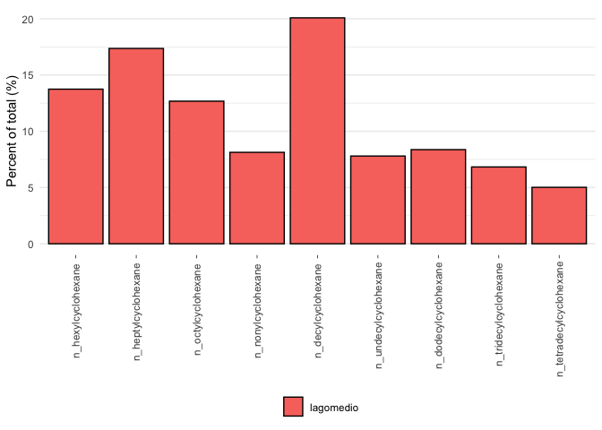

```r
library(tidyverse)
```

```
## ── Attaching packages ─────────────────────────────────────── tidyverse 1.3.2 ──
## ✔ ggplot2 3.4.0      ✔ purrr   0.3.5 
## ✔ tibble  3.1.8      ✔ dplyr   1.0.10
## ✔ tidyr   1.2.1      ✔ stringr 1.5.0 
## ✔ readr   2.1.3      ✔ forcats 0.5.2 
## ── Conflicts ────────────────────────────────────────── tidyverse_conflicts() ──
## ✖ dplyr::filter() masks stats::filter()
## ✖ dplyr::lag()    masks stats::lag()
```

```r
library(janitor)
```

```
## 
## Attaching package: 'janitor'
## 
## The following objects are masked from 'package:stats':
## 
##     chisq.test, fisher.test
```

```r
library(here)
```

```
## here() starts at /Users/blake/Library/Mobile Documents/com~apple~CloudDocs/Desktop/M.Sc./Manuscripts/N-alkanes/R/Alkylcycloalkane data
```

```r
library(gt)
library(broom) 
library(fs)
library(viridis)
```

```
## Loading required package: viridisLite
```


```r
alkylcycloalkane_data <- read_csv(here("data", "tidy_individual_aca_percentages.csv")) %>%
  clean_names() %>%
  pivot_longer(cols = c(n_hexylcyclohexane, n_heptylcyclohexane, n_octylcyclohexane, n_nonylcyclohexane, n_decylcyclohexane, n_undecylcyclohexane, n_dodecylcyclohexane, n_tridecylcyclohexane, n_tetradecylcyclohexane), names_to = "parameter", values_to = "measure")
```

```
## Rows: 32 Columns: 13
## ── Column specification ────────────────────────────────────────────────────────
## Delimiter: ","
## chr (4): site, sample_type, sample_id, sample_depth
## dbl (9): n-Hexylcyclohexane, n-Heptylcyclohexane, n-Octylcyclohexane, n-Nony...
## 
## ℹ Use `spec()` to retrieve the full column specification for this data.
## ℹ Specify the column types or set `show_col_types = FALSE` to quiet this message.
```

```r
alkylcycloalkane_data
```

```
## # A tibble: 288 × 6
##    site    sample_type sample_id sample_depth parameter               measure
##    <chr>   <chr>       <chr>     <chr>        <chr>                     <dbl>
##  1 Bay 102 control     N12       surface      n_hexylcyclohexane        0    
##  2 Bay 102 control     N12       surface      n_heptylcyclohexane       5.00 
##  3 Bay 102 control     N12       surface      n_octylcyclohexane       19.3  
##  4 Bay 102 control     N12       surface      n_nonylcyclohexane       22.8  
##  5 Bay 102 control     N12       surface      n_decylcyclohexane       43.7  
##  6 Bay 102 control     N12       surface      n_undecylcyclohexane      5.75 
##  7 Bay 102 control     N12       surface      n_dodecylcyclohexane      3.06 
##  8 Bay 102 control     N12       surface      n_tridecylcyclohexane     0.360
##  9 Bay 102 control     N12       surface      n_tetradecylcyclohexane   0    
## 10 Bay 102 control     N12       subsurface   n_hexylcyclohexane        0    
## # … with 278 more rows
```


```r
nested_data <- alkylcycloalkane_data %>%
  group_by(site, sample_depth, sample_type) %>%
  nest()
nested_data
```

```
## # A tibble: 14 × 4
## # Groups:   site, sample_depth, sample_type [14]
##    site            sample_type sample_depth data             
##    <chr>           <chr>       <chr>        <list>           
##  1 Bay 102         control     surface      <tibble [27 × 3]>
##  2 Bay 102         control     subsurface   <tibble [27 × 3]>
##  3 Bay 106         oiled       surface      <tibble [36 × 3]>
##  4 Bay 106         oiled       subsurface   <tibble [36 × 3]>
##  5 Bay 11          oiled       surface      <tibble [18 × 3]>
##  6 Bay 11          oiled       subsurface   <tibble [18 × 3]>
##  7 Crude Oil Point oiled       surface      <tibble [18 × 3]>
##  8 Crude Oil Point oiled       subsurface   <tibble [18 × 3]>
##  9 Crude Oil Point control     surface      <tibble [9 × 3]> 
## 10 Crude Oil Point control     subsurface   <tibble [9 × 3]> 
## 11 Milne Inlet     control     surface      <tibble [18 × 3]>
## 12 Milne Inlet     control     subsurface   <tibble [18 × 3]>
## 13 Resolute        control     surface      <tibble [18 × 3]>
## 14 Resolute        control     subsurface   <tibble [18 × 3]>
```


```r
nested_plots <- nested_data %>%
  mutate(plot = pmap(list(site, sample_type, sample_depth, data),
                     ~ ggplot() +
                       geom_col(data = ..4, aes(x = parameter, y = measure, fill = sample_id), colour = "black", position = "dodge") +
                       labs(y = "Percent of total (%)") +
                       scale_x_discrete(limits = c("n_hexylcyclohexane", "n_heptylcyclohexane", "n_octylcyclohexane", "n_nonylcyclohexane", "n_decylcyclohexane", "n_undecylcyclohexane", "n_dodecylcyclohexane", "n_tridecylcyclohexane", "n_tetradecylcyclohexane")) +
                       theme_minimal() +
                       scale_fill_viridis(discrete = TRUE) +
                       theme(axis.title.x = element_blank(),
                             axis.text.x = element_text(angle = 90, vjust = 0.5, hjust = 0.9),
                             legend.title = element_blank(),
                             axis.ticks.x = element_line(size = 0.25),
                             panel.grid.major.x = element_blank(),
                             legend.position = "bottom"),
                     labs(title = str_c(..1, ..2, ..3, "sediments", sep = ", "))),
         filename = str_c(site, sample_type, sample_depth, "plot.pdf", sep = "_"))
```

```
## Warning: The `size` argument of `element_line()` is deprecated as of ggplot2 3.4.0.
## ℹ Please use the `linewidth` argument instead.
```

```r
nested_plots
```

```
## # A tibble: 14 × 6
## # Groups:   site, sample_depth, sample_type [14]
##    site            sample_type sample_depth data              plot   filename   
##    <chr>           <chr>       <chr>        <list>            <list> <chr>      
##  1 Bay 102         control     surface      <tibble [27 × 3]> <gg>   Bay 102_co…
##  2 Bay 102         control     subsurface   <tibble [27 × 3]> <gg>   Bay 102_co…
##  3 Bay 106         oiled       surface      <tibble [36 × 3]> <gg>   Bay 106_oi…
##  4 Bay 106         oiled       subsurface   <tibble [36 × 3]> <gg>   Bay 106_oi…
##  5 Bay 11          oiled       surface      <tibble [18 × 3]> <gg>   Bay 11_oil…
##  6 Bay 11          oiled       subsurface   <tibble [18 × 3]> <gg>   Bay 11_oil…
##  7 Crude Oil Point oiled       surface      <tibble [18 × 3]> <gg>   Crude Oil …
##  8 Crude Oil Point oiled       subsurface   <tibble [18 × 3]> <gg>   Crude Oil …
##  9 Crude Oil Point control     surface      <tibble [9 × 3]>  <gg>   Crude Oil …
## 10 Crude Oil Point control     subsurface   <tibble [9 × 3]>  <gg>   Crude Oil …
## 11 Milne Inlet     control     surface      <tibble [18 × 3]> <gg>   Milne Inle…
## 12 Milne Inlet     control     subsurface   <tibble [18 × 3]> <gg>   Milne Inle…
## 13 Resolute        control     surface      <tibble [18 × 3]> <gg>   Resolute_c…
## 14 Resolute        control     subsurface   <tibble [18 × 3]> <gg>   Resolute_c…
```


```r
nested_plots_save <- nested_plots %>%
  ungroup() %>% 
  select(filename, plot) %>%
  pwalk(ggsave, path =  here("figures"), width = 190, height = 120, units = "mm")
```


```r
aca_control <- read_csv(here("data", "controls_alkylcycloalkanes.csv")) %>%
  clean_names() %>%
  pivot_longer(cols = c(n_hexylcyclohexane, n_heptylcyclohexane, n_octylcyclohexane, n_nonylcyclohexane, n_decylcyclohexane, n_undecylcyclohexane, n_dodecylcyclohexane, n_tridecylcyclohexane, n_tetradecylcyclohexane), names_to = "parameter", values_to = "measure")
```

```
## Rows: 2 Columns: 10
## ── Column specification ────────────────────────────────────────────────────────
## Delimiter: ","
## chr (1): sample_id
## dbl (9): n-Hexylcyclohexane, n-Heptylcyclohexane, n-Octylcyclohexane, n-Nony...
## 
## ℹ Use `spec()` to retrieve the full column specification for this data.
## ℹ Specify the column types or set `show_col_types = FALSE` to quiet this message.
```

```r
aca_control
```

```
## # A tibble: 18 × 3
##    sample_id          parameter               measure
##    <chr>              <chr>                     <dbl>
##  1 surface control    n_hexylcyclohexane        0    
##  2 surface control    n_heptylcyclohexane       3.13 
##  3 surface control    n_octylcyclohexane       14.1  
##  4 surface control    n_nonylcyclohexane       16.2  
##  5 surface control    n_decylcyclohexane       46.6  
##  6 surface control    n_undecylcyclohexane     10.4  
##  7 surface control    n_dodecylcyclohexane      6.11 
##  8 surface control    n_tridecylcyclohexane     3.45 
##  9 surface control    n_tetradecylcyclohexane   0    
## 10 subsurface control n_hexylcyclohexane        0.162
## 11 subsurface control n_heptylcyclohexane       2.59 
## 12 subsurface control n_octylcyclohexane       10.4  
## 13 subsurface control n_nonylcyclohexane       15.4  
## 14 subsurface control n_decylcyclohexane       48.0  
## 15 subsurface control n_undecylcyclohexane      9.76 
## 16 subsurface control n_dodecylcyclohexane      7.56 
## 17 subsurface control n_tridecylcyclohexane     3.61 
## 18 subsurface control n_tetradecylcyclohexane   2.59
```


```r
control_plot <- aca_control %>%
  mutate(across(sample_id, factor, levels=c("surface control","subsurface control"))) %>%
  ggplot() +
  geom_col(aes(x = parameter, y = measure, fill = sample_id), colour = "black", position = "dodge") +
  labs(y = "Percent of total (%)") +
  scale_x_discrete(limits = c("n_hexylcyclohexane", "n_heptylcyclohexane", "n_octylcyclohexane", "n_nonylcyclohexane", "n_decylcyclohexane", "n_undecylcyclohexane", "n_dodecylcyclohexane", "n_tridecylcyclohexane", "n_tetradecylcyclohexane")) +
  theme_minimal() +
  scale_fill_viridis(discrete = TRUE) +
  theme(axis.title.x = element_blank(),
        axis.text.x = element_text(angle = 90, vjust = 0.5, hjust = 0.9),
        legend.title = element_blank(),
        axis.ticks.x = element_line(size = 0.25),
        panel.grid.major.x = element_blank(),
        legend.position = "bottom")
control_plot
```

<!-- -->

```r
ggsave(here("figures", "control_plot.pdf"), control_plot,
       width = 190, height = 120, units = "mm") 
```


```r
lagomedio_data <- read_csv(here("data", "tidy_lagomedio_aca_percentages.csv")) %>%
  clean_names() %>%
   pivot_longer(cols = c(n_hexylcyclohexane, n_heptylcyclohexane, n_octylcyclohexane, n_nonylcyclohexane, n_decylcyclohexane, n_undecylcyclohexane, n_dodecylcyclohexane, n_tridecylcyclohexane, n_tetradecylcyclohexane), names_to = "parameter", values_to = "measure")
```

```
## Rows: 1 Columns: 10
## ── Column specification ────────────────────────────────────────────────────────
## Delimiter: ","
## chr (1): sample_id
## dbl (9): n-Hexylcyclohexane, n-Heptylcyclohexane, n-Octylcyclohexane, n-Nony...
## 
## ℹ Use `spec()` to retrieve the full column specification for this data.
## ℹ Specify the column types or set `show_col_types = FALSE` to quiet this message.
```


```r
lagomedio_plot <- lagomedio_data %>%
  ggplot() +
  geom_col(aes(x = parameter, y = measure, fill = sample_id), colour = "black", position = "dodge") +
  labs(y = "Percent of total (%)") +
  scale_x_discrete(limits = c("n_hexylcyclohexane", "n_heptylcyclohexane", "n_octylcyclohexane", "n_nonylcyclohexane", "n_decylcyclohexane", "n_undecylcyclohexane", "n_dodecylcyclohexane", "n_tridecylcyclohexane", "n_tetradecylcyclohexane")) +
  theme_minimal() +
  #scale_fill_viridis(discrete = TRUE) +
  theme(axis.title.x = element_blank(),
        axis.text.x = element_text(angle = 90, vjust = 0.5, hjust = 0.9),
        legend.title = element_blank(),
        axis.ticks.x = element_line(size = 0.25),
        panel.grid.major.x = element_blank(),
        legend.position = "bottom")
lagomedio_plot
```

<!-- -->

```r
ggsave(here("figures", "lagomedio_plot.pdf"), lagomedio_plot,
       width = 190, height = 120, units = "mm") 
```


