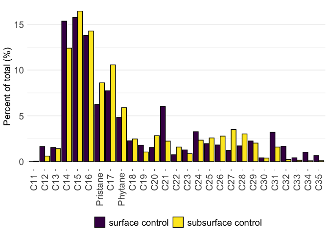
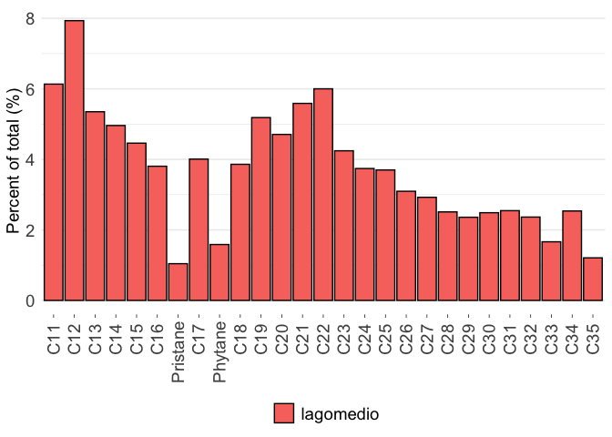

# Code written and executed by **Blake Hunnie** (hunnieb@myumanitoba.ca)
This R-markdown file is intended for the reproducibility of manipulating and presenting data from the BIOS site.
Most of the code included below comes from the **tidyverse**, rather than solely **Base-R**.

# All necessary data & information must be loaded into R:
## First, the packages included in my typical workflows are loaded:


```r
library(tidyverse)
```

```
## ── Attaching packages ─────────────────────────────────────── tidyverse 1.3.2 ──
## ✔ ggplot2 3.4.0      ✔ purrr   1.0.1 
## ✔ tibble  3.1.8      ✔ dplyr   1.0.10
## ✔ tidyr   1.2.1      ✔ stringr 1.5.0 
## ✔ readr   2.1.3      ✔ forcats 0.5.2 
## ── Conflicts ────────────────────────────────────────── tidyverse_conflicts() ──
## ✖ dplyr::filter() masks stats::filter()
## ✖ dplyr::lag()    masks stats::lag()
```

```r
library(janitor)
```

```
## 
## Attaching package: 'janitor'
## 
## The following objects are masked from 'package:stats':
## 
##     chisq.test, fisher.test
```

```r
library(here)
```

```
## here() starts at /Users/blake/Library/Mobile Documents/com~apple~CloudDocs/Desktop/M.Sc./Manuscripts/N-alkanes/R/N-alkane data
```

```r
library(gt)
library(broom) 
library(fs)
library(viridis)
```

```
## Loading required package: viridisLite
```

```r
library(patchwork)
```


```r
alkane_data <- read_csv(here("data", "tidy_individual_alkane_percentages.csv")) %>% #loading in csv. file dataset
  pivot_longer(cols = c(C11, C12, C13, C14, C15, C16, Pristane, C17, Phytane, C18, C19, C20, C21, C22, C23, C24, C25, C26, C27, C28, C29, C30, C31, C32, C33, C34, C35), names_to = "parameter", values_to = "measure") #converting numerous columns into fewer
```

```
## Rows: 32 Columns: 31
## ── Column specification ────────────────────────────────────────────────────────
## Delimiter: ","
## chr  (4): site, sample_type, sample_id, sample_depth
## dbl (27): C11, C12, C13, C14, C15, C16, Pristane, C17, Phytane, C18, C19, C2...
## 
## ℹ Use `spec()` to retrieve the full column specification for this data.
## ℹ Specify the column types or set `show_col_types = FALSE` to quiet this message.
```


```r
nested_data <- alkane_data %>% #assigning the dataset to an object
  group_by(site, sample_depth, sample_type) %>% #grouping the data by 3 variables: site, sample depth and sample type
  nest() #nesting the grouped data
nested_data #calling the nested data
```

```
## # A tibble: 14 × 4
## # Groups:   site, sample_depth, sample_type [14]
##    site            sample_type sample_depth data              
##    <chr>           <chr>       <chr>        <list>            
##  1 Bay_102         control     surface      <tibble [81 × 3]> 
##  2 Bay_102         control     subsurface   <tibble [81 × 3]> 
##  3 Bay_106         oiled       surface      <tibble [108 × 3]>
##  4 Bay_106         oiled       subsurface   <tibble [108 × 3]>
##  5 Bay_11          oiled       surface      <tibble [54 × 3]> 
##  6 Bay_11          oiled       subsurface   <tibble [54 × 3]> 
##  7 Crude_Oil_Point oiled       surface      <tibble [54 × 3]> 
##  8 Crude_Oil_Point oiled       subsurface   <tibble [54 × 3]> 
##  9 Crude_Oil_Point control     surface      <tibble [27 × 3]> 
## 10 Crude_Oil_Point control     subsurface   <tibble [27 × 3]> 
## 11 Milne_Inlet     control     surface      <tibble [54 × 3]> 
## 12 Milne_Inlet     control     subsurface   <tibble [54 × 3]> 
## 13 Resolute        control     surface      <tibble [54 × 3]> 
## 14 Resolute        control     subsurface   <tibble [54 × 3]>
```


```r
nested_plots <- nested_data %>% #assigning the nested data to an object
  mutate(plot = pmap(list(site, sample_type, sample_depth, data), #creating individual objects to automatically generate plots from
                     ~ ggplot() + #creating plots
                       geom_col(data = ..4, aes(x = parameter, y = measure, fill = sample_id), colour = "black", position = "dodge") + #sequentially creating bar plots from the nested data
                       labs(y = "Percent of total (%)") + #labelling the y-axis
                       scale_x_discrete(limits = c("C11", "C12", "C13", "C14", "C15", "C16", "Pristane", "C17", "Phytane", "C18", "C19", "C20", "C21", "C22", "C23", "C24", "C25", "C26", "C27", "C28", "C29", "C30", "C31", "C32", "C33", "C34", "C35")) + #ordering the observations on the x-axis
                       theme_minimal() + #assigning the tidyverse minimal theme to the plot
                       scale_fill_viridis(discrete = TRUE) + #changing the colour palette 
                       theme(axis.title.x = element_blank(), #removing the title from the x-axis
                             axis.title.y = element_text(size = 14), #changing the size of the y-axis title
                             axis.text.x = element_text(angle = 90, vjust = 0.5, hjust = 0.9), #changing the angle of the x-axis text
                             axis.text = element_text(size = 14), #changing the overall size of axis text
                             legend.title = element_blank(), #removing the title from the legend
                             legend.text = element_text(size = 14), #setting the size of the legend text
                             axis.ticks.x = element_line(size = 0.25), #changing the size of the x-axis tick marks
                             panel.grid.major.x = element_blank(), #removing the panelling
                             legend.position = "bottom"), #changing the position of the legend
                     labs(title = str_c(..1, ..2, ..3, "sediments", sep = ", "))), #sequentially assigning the titles for each plot
         filename = str_c(site, sample_type, sample_depth, "plot.pdf", sep = "_")) #assigning a filename to each plot
```

```
## Warning: The `size` argument of `element_line()` is deprecated as of ggplot2 3.4.0.
## ℹ Please use the `linewidth` argument instead.
```

```r
nested_plots #calling the nested plots
```

```
## # A tibble: 14 × 6
## # Groups:   site, sample_depth, sample_type [14]
##    site            sample_type sample_depth data               plot   filename  
##    <chr>           <chr>       <chr>        <list>             <list> <chr>     
##  1 Bay_102         control     surface      <tibble [81 × 3]>  <gg>   Bay_102_c…
##  2 Bay_102         control     subsurface   <tibble [81 × 3]>  <gg>   Bay_102_c…
##  3 Bay_106         oiled       surface      <tibble [108 × 3]> <gg>   Bay_106_o…
##  4 Bay_106         oiled       subsurface   <tibble [108 × 3]> <gg>   Bay_106_o…
##  5 Bay_11          oiled       surface      <tibble [54 × 3]>  <gg>   Bay_11_oi…
##  6 Bay_11          oiled       subsurface   <tibble [54 × 3]>  <gg>   Bay_11_oi…
##  7 Crude_Oil_Point oiled       surface      <tibble [54 × 3]>  <gg>   Crude_Oil…
##  8 Crude_Oil_Point oiled       subsurface   <tibble [54 × 3]>  <gg>   Crude_Oil…
##  9 Crude_Oil_Point control     surface      <tibble [27 × 3]>  <gg>   Crude_Oil…
## 10 Crude_Oil_Point control     subsurface   <tibble [27 × 3]>  <gg>   Crude_Oil…
## 11 Milne_Inlet     control     surface      <tibble [54 × 3]>  <gg>   Milne_Inl…
## 12 Milne_Inlet     control     subsurface   <tibble [54 × 3]>  <gg>   Milne_Inl…
## 13 Resolute        control     surface      <tibble [54 × 3]>  <gg>   Resolute_…
## 14 Resolute        control     subsurface   <tibble [54 × 3]>  <gg>   Resolute_…
```


```r
nested_plots_save <- nested_plots %>% #assigning the nested plots to an object
  ungroup() %>% #must ungroup the nested data to save the individual files
  select(filename, plot) %>% #choosing the parameters to save each file from
  pwalk(ggsave, path =  here("figures"), width = 190, height = 120, units = "mm") #sequentially saving each plot based on the two above variables
```

##This next section is dedicated to creating individual plots from the control sample datasets 


```r
control_data <- read_csv(here("data", "controls.csv")) %>% #loading in the csv.file dataset
  pivot_longer(cols = c(C11, C12, C13, C14, C15, C16, Pristane, C17, Phytane, C18, C19, C20, C21, C22, C23, C24, C25, C26, C27, C28, C29, C30, C31, C32, C33, C34, C35), names_to = "parameter", values_to = "measure") #converting many columns into fewer
```

```
## Rows: 2 Columns: 28
## ── Column specification ────────────────────────────────────────────────────────
## Delimiter: ","
## chr  (1): sample_id
## dbl (27): C11, C12, C13, C14, C15, C16, Pristane, C17, Phytane, C18, C19, C2...
## 
## ℹ Use `spec()` to retrieve the full column specification for this data.
## ℹ Specify the column types or set `show_col_types = FALSE` to quiet this message.
```

```r
control_data #calling the dataset
```

```
## # A tibble: 54 × 3
##    sample_id       parameter measure
##    <chr>           <chr>       <dbl>
##  1 surface control C11          0   
##  2 surface control C12          1.65
##  3 surface control C13          1.54
##  4 surface control C14         15.3 
##  5 surface control C15         15.7 
##  6 surface control C16         13.8 
##  7 surface control Pristane     6.22
##  8 surface control C17          7.74
##  9 surface control Phytane      4.82
## 10 surface control C18          2.27
## # … with 44 more rows
```


```r
control_plot <- control_data %>% #assigning the control dataset to an object
  mutate(across(sample_id, factor, levels=c("surface control","subsurface control"))) %>% #separating the results based on sample depth
  ggplot() + #creating a ggplot
  geom_col(aes(x = parameter, y = measure, fill = sample_id), colour = "black", position = "dodge") + #creating a bar plot
  labs(y = "Percent of total (%)") + #labelling the y-axis
  scale_x_discrete(limits = c("C11", "C12", "C13", "C14", "C15", "C16", "Pristane", "C17", "Phytane", "C18", "C19", "C20", "C21", "C22", "C23", "C24", "C25", "C26", "C27", "C28", "C29", "C30", "C31", "C32", "C33", "C34", "C35")) + #assigning the order to the observations on the x-axis
  theme_minimal() + #applying the minimal tidyverse theme to the plot
  scale_fill_viridis(discrete = TRUE) + #changing the colour palette
  theme(axis.title.x = element_blank(), #removing the title from the x-axis
        axis.text.x = element_text(angle = 90, vjust = 0.5, hjust = 0.9), #changing the angle of the text on the x-axis
        axis.text = element_text(size = 14), #setting the size of the axis text
        axis.title.y = element_text(size = 14), #setting the size of the y-axis title
        legend.text = element_text(size = 14), #setting the size of the legend text
        legend.title = element_blank(), #removing the title from the legend
        axis.ticks.x = element_line(size = 0.25), #changing the size of the x-axis tick marks
        panel.grid.major.x = element_blank(), #removing the panelling
        legend.position = "bottom") #changing the position of the legend
control_plot #calling the plot
```

<!-- -->

```r
ggsave(here("figures", "control_plot.pdf"), control_plot, #saving the plot as a pdf. file
       width = 190, height = 120, units = "mm") #setting the size parameters of the save file
```

##Finally, this section does the same as the control samples, but for the technical mixture (refer to comments in the above section)


```r
lagomedio_data <- read_csv(here("data", "tidy_lagomedio_alkane_percentages.csv")) %>%
  pivot_longer(cols = c(C11, C12, C13, C14, C15, C16, Pristane, C17, Phytane, C18, C19, C20, C21, C22, C23, C24, C25, C26, C27, C28, C29, C30, C31, C32, C33, C34, C35), names_to = "parameter", values_to = "measure")
```

```
## Rows: 1 Columns: 28
## ── Column specification ────────────────────────────────────────────────────────
## Delimiter: ","
## chr  (1): sample_id
## dbl (27): C11, C12, C13, C14, C15, C16, Pristane, C17, Phytane, C18, C19, C2...
## 
## ℹ Use `spec()` to retrieve the full column specification for this data.
## ℹ Specify the column types or set `show_col_types = FALSE` to quiet this message.
```


```r
lagomedio_plot <- lagomedio_data %>%
  ggplot() +
  geom_col(aes(x = parameter, y = measure, fill = sample_id), colour = "black", position = "dodge") +
  labs(y = "Percent of total (%)") +
  scale_x_discrete(limits = c("C11", "C12", "C13", "C14", "C15", "C16", "Pristane", "C17", "Phytane", "C18", "C19", "C20", "C21", "C22", "C23", "C24", "C25", "C26", "C27", "C28", "C29", "C30", "C31", "C32", "C33", "C34", "C35")) +
  theme_minimal() +
  theme(axis.title.x = element_blank(),
        axis.text.x = element_text(angle = 90, vjust = 0.5, hjust = 0.9),
        axis.text = element_text(size = 14),
        axis.title.y = element_text(size = 14),
        legend.text = element_text(size = 14),
        legend.title = element_blank(),
        legend.position = "bottom",
        axis.ticks.x = element_line(linewidth = 0.25),
        panel.grid.major.x = element_blank())
lagomedio_plot
```

<!-- -->

```r
ggsave(here("figures", "lagomedio_alkane_composition.pdf"), lagomedio_plot,
       width = 190, height = 120, units = "mm") 
```


