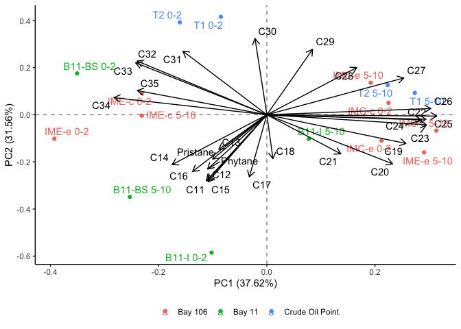

# Code written and executed by **Blake Hunnie** (hunnieb@myumanitoba.ca)
This R-markdown file is intended for the reproducibility of manipulating and presenting data from the BIOS site.
Most of the code included below comes from the **tidyverse**, rather than solely **Base-R**.

# All necessary data & information must be loaded into R:
## First, the packages included in my typical workflows are loaded:


```r
library(tidyverse)
```

```
## ── Attaching packages ─────────────────────────────────────── tidyverse 1.3.2 ──
## ✔ ggplot2 3.4.0      ✔ purrr   1.0.1 
## ✔ tibble  3.1.8      ✔ dplyr   1.0.10
## ✔ tidyr   1.2.1      ✔ stringr 1.5.0 
## ✔ readr   2.1.3      ✔ forcats 0.5.2 
## ── Conflicts ────────────────────────────────────────── tidyverse_conflicts() ──
## ✖ dplyr::filter() masks stats::filter()
## ✖ dplyr::lag()    masks stats::lag()
```

```r
library(janitor)
```

```
## 
## Attaching package: 'janitor'
## 
## The following objects are masked from 'package:stats':
## 
##     chisq.test, fisher.test
```

```r
library(here)
```

```
## here() starts at /Users/blake/Library/Mobile Documents/com~apple~CloudDocs/Desktop/M.Sc./Manuscripts/N-alkanes/R/PCA Tests
```

```r
library(gt)
library(broom) 
library(fs)
library(stats)
library(ggrepel)
library(patchwork)
library(ggfortify)
library(knitr)
library(viridis)
```

```
## Loading required package: viridisLite
```


```r
alkane_dataset <- read_csv(here("data", "tidy_individual_alkanes_pca.csv")) #loading in the csv.file dataset
```

```
## Rows: 16 Columns: 29
## ── Column specification ────────────────────────────────────────────────────────
## Delimiter: ","
## chr  (2): site, sample_id
## dbl (27): C11, C12, C13, C14, C15, C16, Pristane, C17, Phytane, C18, C19, C2...
## 
## ℹ Use `spec()` to retrieve the full column specification for this data.
## ℹ Specify the column types or set `show_col_types = FALSE` to quiet this message.
```


```r
nalk_pca <- alkane_dataset %>% #assigning the loaded dataset to an object
  nest() %>% #nesting the data
  mutate(pca = map(data, ~prcomp(.x %>% select(-site, -sample_id), center = TRUE, scale = TRUE)), #performing a PCA while distinguishing results based on the sites and sample IDs
         pca_aug = map2(pca, data, ~augment(.x, data = .y))) #adding augmented data from the PCA to the dataset 
```

```
## Warning: `...` must not be empty for ungrouped data frames.
## Did you want `data = everything()`?
```

```r
nalk_pca #calling the object
```

```
## # A tibble: 1 × 3
##   data               pca      pca_aug           
##   <list>             <list>   <list>            
## 1 <tibble [16 × 29]> <prcomp> <tibble [16 × 46]>
```


```r
test_plot <- nalk_pca %>% #assigning the PCA results to an object
  mutate(pca_graph = map2(.x = pca, .y = data, 
                          ~autoplot(.x, loadings = TRUE, loadings.label = TRUE, loadings.label.repel = TRUE, loadings.colour = "black", loadings.label.colour = "black",
                                    data = .y, label = TRUE, label.label = "sample_id", label.repel = TRUE, colour = "site", face = "bold") + #plotting the results of the PCA
                            geom_hline(aes(yintercept = 0), linetype = "dashed", alpha = 0.5) + #adding a dashed horizontal line on y=0
                            geom_vline(aes(xintercept = 0), linetype = "dashed", alpha = 0.5) + #adding a dashed vertical line on x=0
                            theme_classic() + #applying the classic tidyverse theme to the plot
                            theme(legend.title = element_blank(), #removing the legend title
                                  legend.position = "bottom"))) #changing the position of the legend
test_plot$pca_graph #calling the PCA plot
```

```
## [[1]]
```

<!-- -->

```r
#The plot can be saved by right-clicking the image and selecting "save image as."
```


