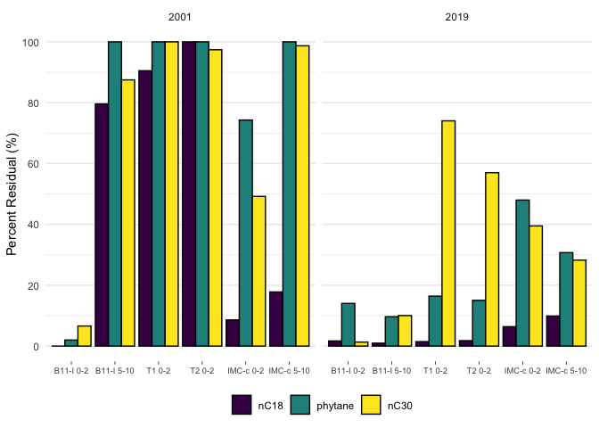

# Code written and executed by **Blake Hunnie** (hunnieb@myumanitoba.ca)
This R-markdown file is intended for the reproducibility of manipulating and presenting data from the BIOS site.
Most of the code included below comes from the **tidyverse**, rather than solely **Base-R**.

# All necessary data & information must be loaded into R:
## First, the packages included in my typical workflows are loaded:


```r
library(tidyverse)
```

```
## ── Attaching packages ─────────────────────────────────────── tidyverse 1.3.2 ──
## ✔ ggplot2 3.4.0      ✔ purrr   1.0.1 
## ✔ tibble  3.1.8      ✔ dplyr   1.0.10
## ✔ tidyr   1.2.1      ✔ stringr 1.5.0 
## ✔ readr   2.1.3      ✔ forcats 0.5.2 
## ── Conflicts ────────────────────────────────────────── tidyverse_conflicts() ──
## ✖ dplyr::filter() masks stats::filter()
## ✖ dplyr::lag()    masks stats::lag()
```

```r
library(janitor)
```

```
## 
## Attaching package: 'janitor'
## 
## The following objects are masked from 'package:stats':
## 
##     chisq.test, fisher.test
```

```r
library(here)
```

```
## here() starts at /Users/blake/Library/Mobile Documents/com~apple~CloudDocs/Desktop/M.Sc./Manuscripts/N-alkanes/R/Percent Loss Comparison
```

```r
library(gt)
library(broom) 
library(fs)
library(viridis)
```

```
## Loading required package: viridisLite
```


```r
percent_residual_data <- read_csv(here("data", "tidy_percent_residual_comparison.csv")) %>% #loading in the csv.file dataset
  clean_names() %>% #altering the column names in accordance to the tidyverse
  rename(nC18 = n_c18, nC30 = n_c30) %>% #renaming columns 
  pivot_longer(cols = c(nC18, phytane, nC30), names_to = "parameter", values_to = "measure") #converting numerous columns into fewer
```

```
## Rows: 12 Columns: 5
## ── Column specification ────────────────────────────────────────────────────────
## Delimiter: ","
## chr (1): sample_id
## dbl (4): sample_year, nC18, Phytane, nC30
## 
## ℹ Use `spec()` to retrieve the full column specification for this data.
## ℹ Specify the column types or set `show_col_types = FALSE` to quiet this message.
```

```r
percent_residual_data #calling the dataset
```

```
## # A tibble: 36 × 4
##    sample_id  sample_year parameter measure
##    <chr>            <dbl> <chr>       <dbl>
##  1 B11-I 0-2         2001 nC18          0  
##  2 B11-I 0-2         2001 phytane       2  
##  3 B11-I 0-2         2001 nC30          6.6
##  4 B11-I 5-10        2001 nC18         79.6
##  5 B11-I 5-10        2001 phytane     100  
##  6 B11-I 5-10        2001 nC30         87.5
##  7 T1 0-2            2001 nC18         90.5
##  8 T1 0-2            2001 phytane     100  
##  9 T1 0-2            2001 nC30        100  
## 10 T2 0-2            2001 nC18        100  
## # … with 26 more rows
```


```r
percent_residual_plot <- percent_residual_data %>% #assigning the dataset to an object
  mutate(parameter = factor(parameter, levels = c("nC18", "phytane", "nC30"))) %>% #assigning the order of the variables
  ggplot() + #creating the ggplot item
  facet_wrap(~sample_year, ncol = 2) + #creating a two-windowed plot
  geom_col(aes(x = sample_id, y = measure, fill = parameter), colour = "black", position = "dodge") + #creating bar plots
  labs(y = "Percent Residual (%)") + #labelling the y-axis
  scale_x_discrete(limits = c("B11-I 0-2", "B11-I 5-10", "T1 0-2", "T2 0-2", "IMC-c 0-2", "IMC-c 5-10")) + #assigning the order of the samples
  scale_y_continuous(breaks = seq(0, 100, by = 20)) + #setting the y-axis tick breaks
  theme_minimal() + #applying the tidyverse minimal theme to the plot
  scale_fill_viridis(discrete = TRUE) + #changing the colour palette
  theme(axis.title.x = element_blank(), #removing the x-axis title
        axis.text.x = element_text(size = 7), #changing the size of the x-axis text
        legend.title = element_blank(), #removing the title from the legend
        axis.ticks.x = element_line(size = 0.25), #changing the size of the x-axis tick marks
        panel.grid.major.x = element_blank(), #removing the panelling
        legend.position = "bottom") #altering the position of the legend
```

```
## Warning: The `size` argument of `element_line()` is deprecated as of ggplot2 3.4.0.
## ℹ Please use the `linewidth` argument instead.
```

```r
percent_residual_plot #calling the plot
```

<!-- -->

```r
ggsave(here("figures", "percent_residual_comparison.pdf"), percent_residual_plot, #saving the plot as a pdf. file
       width = 190, height = 120, units = "mm") #setting the size parameters of the save file
```


