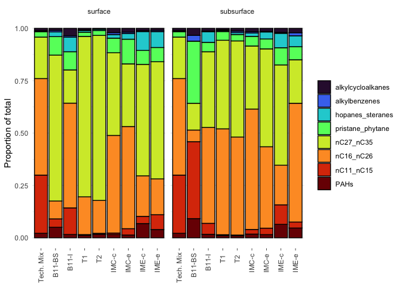

# Code written and executed by **Blake Hunnie** (hunnieb@myumanitoba.ca)
This R-markdown file is intended for the reproducibility of manipulating and presenting data from the BIOS site.
Most of the code included below comes from the **tidyverse**, rather than solely **Base-R**.

# All necessary data & information must be loaded into R:
##loading the necessary packages for the following code:


```r
library(tidyverse)
```

```
## ── Attaching packages ─────────────────────────────────────── tidyverse 1.3.2 ──
## ✔ ggplot2 3.4.0      ✔ purrr   1.0.1 
## ✔ tibble  3.1.8      ✔ dplyr   1.0.10
## ✔ tidyr   1.2.1      ✔ stringr 1.5.0 
## ✔ readr   2.1.3      ✔ forcats 0.5.2 
## ── Conflicts ────────────────────────────────────────── tidyverse_conflicts() ──
## ✖ dplyr::filter() masks stats::filter()
## ✖ dplyr::lag()    masks stats::lag()
```

```r
library(janitor)
```

```
## 
## Attaching package: 'janitor'
## 
## The following objects are masked from 'package:stats':
## 
##     chisq.test, fisher.test
```

```r
library(here)
```

```
## here() starts at /Users/blake/Library/Mobile Documents/com~apple~CloudDocs/Desktop/M.Sc./Manuscripts/N-alkanes/R/updated_compound_group_percentages
```

```r
library(gt)
library(broom) 
library(fs)
library(viridis)
```

```
## Loading required package: viridisLite
```


```r
group_data <- read_csv(here("data", "tidy_compound_group_percentages_updated.csv")) %>% #loads in csv file dataset
  clean_names() %>% #alters column names into tidy format
  rename(nC11_nC15 = n_c11_n_c15, nC16_nC26 = n_c16_n_c26, nC27_nC35 = n_c27_n_c35, PAHs = pahs, hopanes_steranes = biomarkers, alkylbenzenes = alkyl_benzenes, alkylcycloalkanes = alkyl_cyclo_alkanes) %>% #renaming column titles 
  pivot_longer(cols = c(PAHs, nC11_nC15, nC16_nC26, nC27_nC35, pristane_phytane, hopanes_steranes, alkylbenzenes, alkylcycloalkanes), names_to = "parameter", values_to = "measure") #compiling many columns into fewer ones
```

```
## Rows: 18 Columns: 12
## ── Column specification ────────────────────────────────────────────────────────
## Delimiter: ","
## chr (4): site, sample_type, sample_id, sample_depth
## dbl (8): nC11-nC15, nC16-nC26, nC27-nC35, pristane & phytane, pahs, biomarke...
## 
## ℹ Use `spec()` to retrieve the full column specification for this data.
## ℹ Specify the column types or set `show_col_types = FALSE` to quiet this message.
```


```r
group_plot <- group_data %>% #assigning the dataset to an object
  mutate(across(sample_depth, factor, levels=c("surface","subsurface"))) %>% #separating the data by sample depth
  mutate(across(parameter, factor, levels=c("alkylcycloalkanes", "alkylbenzenes", "hopanes_steranes", "pristane_phytane", "nC27_nC35", "nC16_nC26", "nC11_nC15", "PAHs"))) %>% #within each sample depth, separating by compound groups
  ggplot() + #creating a ggplot
  facet_wrap(~sample_depth) + #making a two-window plot based on sample depth
  geom_col(aes(x = sample_id, y = measure, fill = parameter), colour = "black", position = "fill") + #creating bar plots
  labs(y = "Proportion of total") + #labelling the y-axis
  scale_x_discrete(limits = c("Tech. Mix", "B11-BS", "B11-I", "T1", "T2", "IMC-c", "IMC-e", "IME-c", "IME-e")) + #ordering the samples along the x-axis 
  theme_minimal() + #using the tidyverse minimal theme
 scale_fill_viridis(discrete = TRUE, option = "turbo") + #adding custom colour palette 
  theme(axis.title.x = element_blank(), #removing the title from the x-axis
        axis.text.x = element_text(angle = 90, vjust = 0.5, hjust = 0.9), #changing the angle and position of x-axis text
        legend.title = element_blank(), #removing the title from the legend
        axis.ticks.x = element_line(linewidth = 0.25), #changing the size of the x-axis tick marks
        panel.grid.major.x = element_blank()) #removing the panelling
group_plot #calling the finished plot
```

<!-- -->


```r
ggsave(here("figures", "group_plot.pdf"), group_plot, #saving the plot as a pdf. file
       width = 190, height = 120, units = "mm") #setting the plot size parameters

ggsave(here("figures", "group_plot.png"), group_plot, #saving the plot as a png. file
       width = 190, height = 120, units = "mm") #setting the plot size parameters
```


